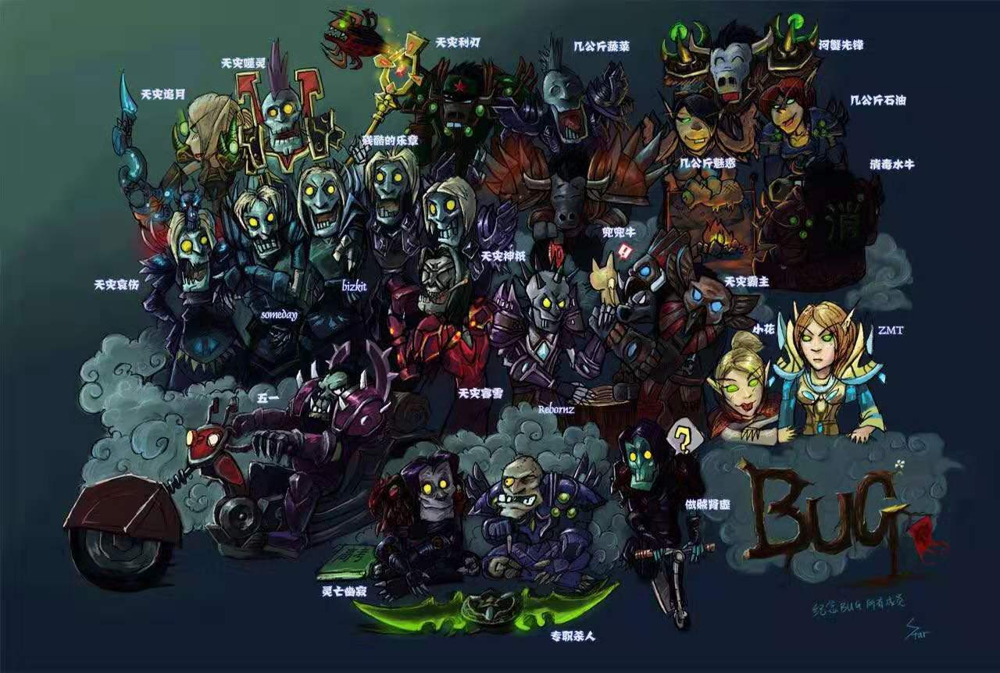

## BUG 公会

### 奥罗部落
**公会制度简章**
1. 公会内部出现任何矛盾，若私下无法调解，可直接上报公会官员，不可进行语言攻击。
2. 公会会员应帮助公会成长，不得做出损坏公会形象、影响公会名誉的行为。
3. 公会不为任何买卖金币装备的行为担保，如想买卖装备可参与公会内需GKP团。

> 怀旧服就是个世界，没有改名没有转服，请为自己的行为负责。 --会长留

### 加入我们
战网群组：[点击加入](https://blizzardgames.cn/invite/bxqK4ojuz4J)

[ [查看更多...](joinUs.md) ]

### 插件地址

1. [60addons.com](http://60addons.com)

[ [查看更多...](plugIn.md) ]

### 反和谐

1. 打开_classic_文件夹，在其中找到WTF文件夹，用记事本打开Config.wtf文件，将上述命令输入进去保存即可。
2. SET overrideArchive "0"  反骨头和墓碑和谐（主要对亡灵身上多余的肉）
3. SET profanityFilter "0"  反语言屏蔽（主要针对卧槽我操牛B了之类的语言）  

### 2007
