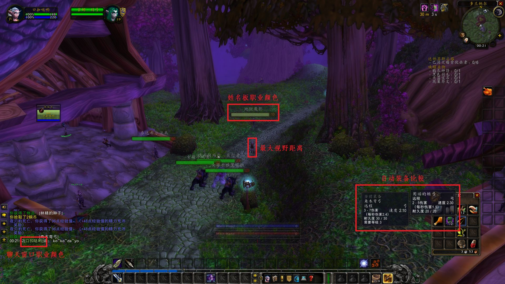

[返回首页](https://a-ethan.github.io/bug/)

## BUG 公会

### 插件地址

1. [60addons.com](http://60addons.com)

### 非插件界面增强

> 待测试功能



* 打开装备自动比较 (常驻)

1代表打开 0代表关闭

```
/run SetCVar("alwaysCompareItems", "1")
```

* 最大镜头距离 (读蓝条失效 可避免)

最多到4

```
/console cameraDistanceMaxZoomFactor 4
```
这句只要重新加载(读蓝条)就会失效 但是你要是不调整镜头会一直卡在4 建议把滚轮改成其他按键

* 设置血液效果等级 (常驻)

最后一位数字代表暴力等级 默认是2 最大是5 最小是0

```
/console violenceLevel 2
```

* 敌方姓名板显示职业颜色 (常驻)

0代表关闭 1代表打开

```
/console ShowClassColorInNameplate 1
```
　　
* 友方姓名板显示职业颜色 (常驻)

0代表关闭 1代表打开

```
/console ShowClassColorInFriendlyNameplate 1
```

* 聊天窗口显示职业颜色 (常驻)

0代表打开 1代表关闭

```
/console SET chatClassColorOverride "0"
```

>重要！在使用后再输入一次 /rl 重新加载页面！